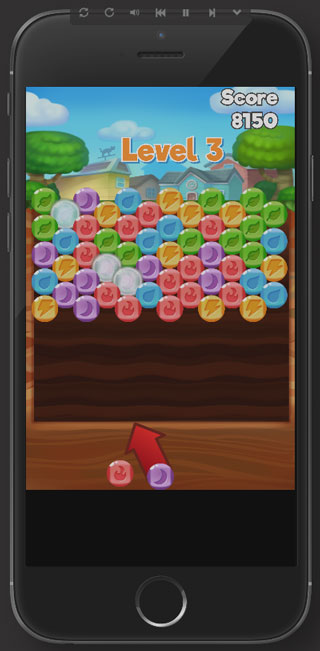
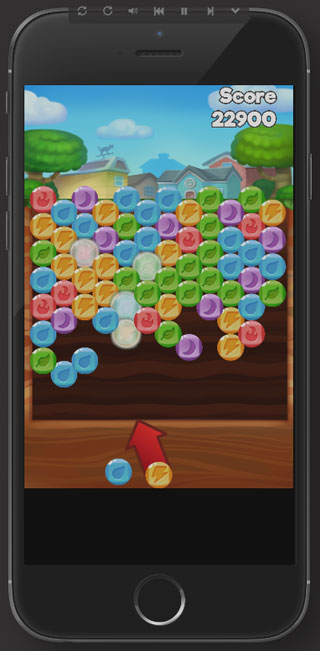
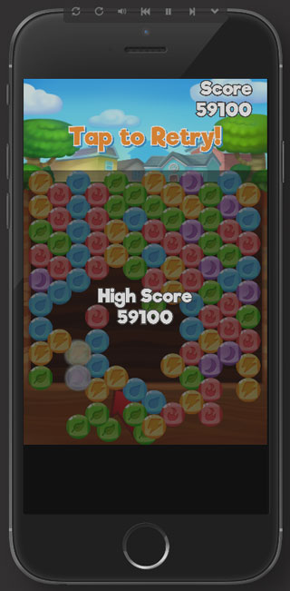
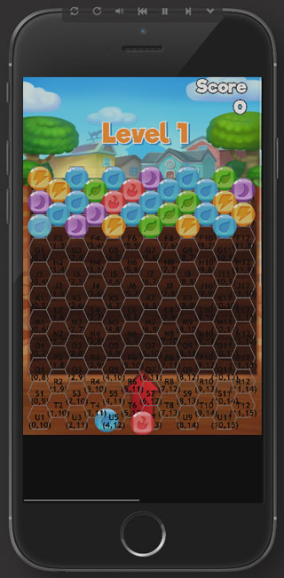

- - - -

# README #

This mobile bubble shooter is a combination of the objective-based gameplay of Bubble Mania with the infinite gameplay of survival mode. Just play as long as you can! The constraints of the project were to base the mechanics of the game on a hexagonal grid system to create a match-3 bubble shooter, all in about a week.

## How do I get set up? ##
This project was built with the open-source GameClosure Devkit (GC Devkit). Make sure you have devkit installed before moving on:
[http://docs.gameclosure.com/guide/install.html](http://docs.gameclosure.com/guide/install.html)

Once you have devkit, clone this repo into your own project directory.
From there, _cd_ into your project and run:

* `devkit install`
* `devkit serve`

This will build the core modules into the project and then serve the app from localhost.

The game has sound and music so watch your speaker volume ^-^

## Game flow ##

The game starts right away, from level 1. As levels progress, more rows are added on the grid to start with. Every few turns, an additional row is pushed from the top, a "survival mode" as it were. To complete the level, the player must capture all the shiny objective bubbles in the stage. Every level adds more objective bubbles. Once the max difficulty is reached (meaning no more rows will be added per stage) additional rows will be pushed from the top more frequently. The game continues infinitely until at least one bubble from the grid collides with the cannon's unfired bubble.

## Process ##

### Ramp-up ###

I began with the Hello World boilerplate, then took elements out of the [Whack That Mole](http://docs.gameclosure.com/guide/game-walkthrough.html) tutorial project to build a scaffold for my own game.

Checking out the tutorial was essential for understanding the view pool and how devkit propagates events through the views. At first I thought I would need a physics engine to detect collisions and fire projectiles, so I sent time trying to assimilate an existing physics library into the game. Then I found a [ported version of Box2d for use with devkit](https://github.com/asciiu/gcBox2D).

Only when I got it running did I realize that simple vector math would be enough to update positions and check for intersections, however it was interesting to see how libraries could be adapted for the devkit class system and hook into the GameClosure app's built-in *render* and *tick* methods.

#### Grid ####
When it came time to design the hexagon grid, I picked up a lot about the geometry and coordinate systems from [this excellent article by amitp](http://www.redblobgames.com/grids/hexagons/). From there I stumbled on the [Hexagon Tools](https://github.com/mpalmerlee/HexagonTools) repo by mpalmerlee. I rewrote the class declarations to be able to *import* the hexagon tools much like other devkit components, and decorated it with public and static methods I needed for my game. I used the hex grid to track coordinates and views (a *View* is a visual object on a GC app's canvas) as they moved through the space. For debugging, I created a separate hex grid canvas and hooked into the *render* method of the game screen so I could draw a visual representation of the grid in the game screen's 2d context.

From there I created a *BubbleGrid* which was a class containing several *Bubble* views. It existed on a separate layer from the hexagon grid but shared the same relative coordinate system. Each bubble on the grid shared an ID with a corresponding hexagon in the underlying grid. The biggest challenge was linking the various coordinate systems together, of which there were three:

* literal pageX and pageY
* coOrd points, where each hexagon represents a point
* numbers columns + letter rows

Depending on the operation involved, I needed to use one or more of these coordinate systems to find and manipulate bubbles on the grid as needed.

#### Movement ####

I ended up using vectors from the devkit *Math*. Basic trig functions and the unit circle helped me to compare vectors to derive the aim of bubble cannon (the *Shooter* class), adapted for a top-left coordinate system and game screen whose “zero” radian position is on the unit circle as PI / 2. This took some figuring out.

To shoot bubbles from the cannon, I found an excellent resource about how bubble shooters work with this [HTML5 bubble shooter guide](http://rembound.com/articles/bubble-shooter-game-tutorial-with-html5-and-javascript). It showed how I could use the angles I computed and hook into the *tick* function of the *Shooter* view to plug *dt* (time) into the function that mapped movement along a 2d vector.

#### Collisions ####

Then as soon as the shooter's bubble intersected with a grid bubble (via intersecting bounding shapes), I detected which hexagon existed at the center point of the shooter's bubble and attached an new bubble to the hex grid at that point, linked via that hex's id. Interestingly there was no devkit *Math.geom* utility for 2 intersecting circles, only combinations of circles and rectangles and points. So I had to include a simple trig-based function to evaluate two rectangles AS IF they were circles.

Once I detected a collision I had to find matching bubbles.
The above-mentioned guide showed the underlying algorithm for detecting match-3 clusters and floating bubbles, which I adapted for use with my literal hexagon grid. (The guide builds a game on top of a 2d array of offset columns and rows.)

## Credits ##

The original Hexagon Tools class, which contains the underlying geometry for drawing the hexagon grid to the canvas, was written by mpalmerlee:
[https://github.com/mpalmerlee/HexagonTools](https://github.com/mpalmerlee/HexagonTools)

This is an excellent guide to hexagon coordinate systems by amitp:
[http://www.redblobgames.com/grids/hexagons/](http://www.redblobgames.com/grids/hexagons/)

Awesome chiptune by Toni Leys:
[https://soundcloud.com/tonileys/through-a-cardboard-world](https://soundcloud.com/tonileys/through-a-cardboard-world)

Assets:
[http://opengameart.org/](http://opengameart.org/)

Sounds:
[https://freesound.org/](https://freesound.org/)

The following README is useful for pulling a boilerplate into your project from scratch right away ↓

devkit-application-template
===========================

Initial file structure for Gameclosure Devkit applications.

Includes an empty folder structure that matches the devkit defaults
and a minimal Application.js file with a "Hello, world!" text view.

You can specify a different initial template for new devkit applications
by adding the `--git-template` paramater to `devkit init` and passing in
a path to a git repository.

~~~
devkit init newproject --git-template https://github.com/gameclosure/devkit-application-template
~~~
